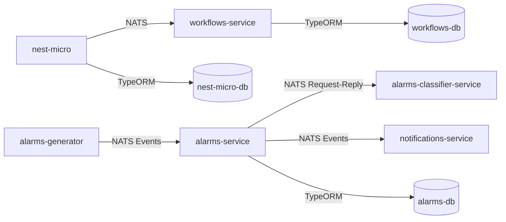

# NestJS Microservices Architecture

## Project Overview

This project demonstrates a microservices architecture using NestJS framework. It consists of multiple services that communicate with each other using NATS as a message broker. Each service has its own PostgreSQL database and can be run independently using Docker.

> **Note:** This project is currently under development and not all features are complete.

## Architecture

The project follows a microservices architecture with the following components:

- **nest-micro**: Main service that manages buildings and communicates with the workflows service
- **workflows-service**: Microservice that handles workflows associated with buildings
- **alarms-generator**: Service that generates alarm events and sends them to the alarms-service
- **alarms-service**: Service that processes and manages alarms received from the alarms-generator
- **alarms-classifier-service**: Service that classifies alarms based on their characteristics
- **notifications-service**: Service that handles sending notifications through various channels
- **NATS**: Message broker for service-to-service communication
- **PostgreSQL**: Separate database instances for each service

### Communication Flow



## Project Structure

```text
nest-micro/
├── apps/
│   ├── nest-micro/            # Main service
│   │   └── src/
│   │       ├── buildings/     # Buildings module
│   │       └── health/        # Health check endpoints
│   ├── workflows-service/     # Workflows microservice
│   │   └── src/
│   │       ├── workflows/     # Workflows module
│   │       └── health/        # Health check endpoints
│   ├── alarms-generator/      # Service that generates alarms
│   │   └── src/
│   │       └── alarms-generator.service.ts
│   ├── alarms-service/        # Service that processes alarms
│   │   └── src/
│   │       └── alarms-service.controller.ts
│   ├── alarms-classifier-service/ # Service that classifies alarms
│   │   └── src/
│   │       └── alarms-classifier-service.controller.ts
│   └── notifications-service/  # Service that sends notifications
│       └── src/
│           └── notifications-service.controller.ts
├── libs/
│   └── workflows/             # Shared DTOs and interfaces
├── docker-compose.yml         # Docker configuration
└── .env                       # Environment variables
```

## NATS Messaging Patterns

This project utilizes NATS as the message broker for communication between microservices. NATS supports different messaging patterns, and this project specifically implements:

### Queue Groups (Load Balancing)

The workflow-service is configured to use NATS queue groups, which ensures that:

- Multiple instances of the service can run concurrently (currently set to 3 replicas)
- Each message is processed by only one service instance
- Automatic load balancing occurs across service instances

```typescript
// In workflows-service/main.ts
app.connectMicroservice<MicroserviceOptions>({
  transport: Transport.NATS,
  options: {
    servers: process.env.NATS_URL,
    queue: 'workflows-service', // Queue group name
  },
});
```

This configuration ensures that when the main service sends a message to create a workflow, only one of the three workflows-service instances will process it, preventing duplicate workflow creation.

Similarly, the alarms-service uses a queue group to ensure alarms are processed reliably:

```typescript
// In alarms-service/main.ts
app.connectMicroservice<MicroserviceOptions>({
  transport: Transport.NATS,
  options: {
    servers: process.env.NATS_URL,
    queue: 'alarms-service', // Queue group name
  },
});
```

### Request-Reply Pattern

The project uses the request-reply pattern for communication between services:

- The main service (`nest-micro`) sends requests to the workflows service
- The workflow service processes the request and sends a reply

```typescript
// In nest-micro/buildings.service.ts
const pattern: string = 'workflows.create';
const payload: CreateWorkflowDto = { name: 'New Workflow', buildingId };
const newWorkflow = await lastValueFrom(
  this.natsClient.send<string, CreateWorkflowDto>(pattern, payload),
);
```

### Event-based Pattern (Publish/Subscribe)

The alarms system uses an event-based approach where:

- The alarms-generator service publishes events but doesn't wait for responses
- The alarms-service subscribes to these events and processes them asynchronously

```typescript
// In alarms-generator/alarms-generator.service.ts
this.alarmsClient.emit('alarm.created', alarmEvent);
```

This pattern allows for decoupled communication where the publisher doesn't need to know which services (or how many) are processing the event, making the system more scalable and resilient.

## Orchestration Approach

The system implements a sophisticated orchestration pattern for handling alarms, leveraging multiple microservices working together as a processing pipeline:

### Alarm Processing Pipeline

1. The alarm processing begins with the `alarms-generator` service producing alarm events
2. These events are consumed by the `alarms-service`
3. The `alarms-service` then orchestrates the subsequent processing:
   - It forwards alarms to the `alarms-classifier-service` for classification
   - Based on classification results, it may trigger notifications

### Alarm Classification Service

The `alarms-classifier-service` uses a request-reply pattern to classify alarms on demand:

```typescript
// In alarms-classifier-service/alarms-classifier-service.controller.ts
@MessagePattern({ cmd: 'alarm.classify' })
classifyAlarm(@Payload() data: unknown) {
  this.logger.debug(`Received message: ${JSON.stringify(data)}`);
  return {
    category: ['critical', 'non-critical', 'invalid'][
      Math.floor(Math.random() * 3)
    ],
  };
}
```

This service is designed to run complex classification algorithms in a production environment:

- It provides a dedicated microservice for computationally intensive classification logic
- It supports scalability by allowing multiple instances behind a NATS queue group
- The classification logic is isolated, enabling independent updates and improvements

### Notifications Service

The `notifications-service` uses an event-based pattern to handle notifications triggered by various system events:

```typescript
// In notifications-service/notifications-service.controller.ts
@EventPattern('notification.send')
sendNotification(data: any) {
  this.logger.debug('Received notification event', data);
}
```

Key features of the notifications orchestration:

- Asynchronous event-driven architecture allows for decoupled notification processing
- The notifications service can be scaled independently based on notification volume
- Different notification channels (email, SMS, push) can be implemented within the same service

### Benefits of the Orchestration Approach

1. **Separation of Concerns**: Each service has a clearly defined responsibility
2. **Scalability**: Services can be scaled independently based on their specific resource requirements
3. **Resilience**: The distributed nature of the system ensures that failures in one service don't bring down the entire system
4. **Flexibility**: New services can be added to the processing pipeline without modifying existing ones
5. **Maintainability**: Services can be developed, deployed, and maintained by different teams
