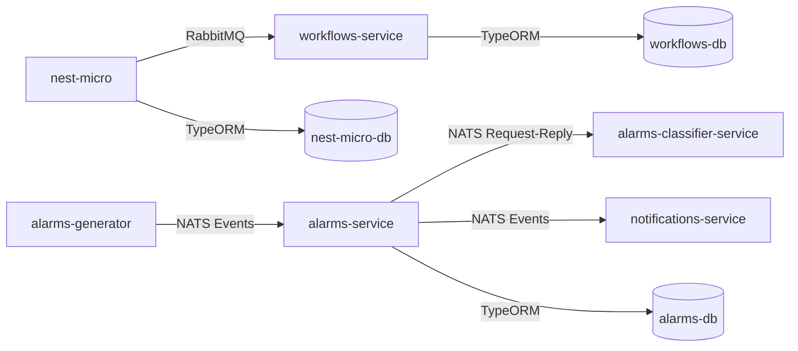

# NestJS Microservices Architecture

## Project Overview

This project demonstrates a microservices architecture using NestJS framework. It consists of multiple services that communicate with each other using both NATS and RabbitMQ as message brokers. Each service has its own PostgreSQL database and can be run independently using Docker.

> **Note:** This project is currently under development and not all features are complete.

## Architecture

The project follows a microservices architecture with the following components:

- **nest-micro**: Main service that manages buildings and communicates with the workflows service
- **workflows-service**: Microservice that handles workflows associated with buildings
- **alarms-generator**: Service that generates alarm events and sends them to the alarms-service
- **alarms-service**: Service that processes and manages alarms received from the alarms-generator
- **alarms-classifier-service**: Service that classifies alarms based on their characteristics
- **notifications-service**: Service that handles sending notifications through various channels
- **NATS & RabbitMQ**: Message brokers for service-to-service communication
- **PostgreSQL**: Separate database instances for each service

### Communication Flow



## Project Structure

```text
nest-micro/
├── apps/
│   ├── nest-micro/            # Main service
│   │   └── src/
│   │       ├── buildings/     # Buildings module
│   │       └── health/        # Health check endpoints
│   ├── workflows-service/     # Workflows microservice
│   │   └── src/
│   │       ├── workflows/     # Workflows module
│   │       └── health/        # Health check endpoints
│   ├── alarms-generator/      # Service that generates alarms
│   │   └── src/
│   │       └── alarms-generator.service.ts
│   ├── alarms-service/        # Service that processes alarms
│   │   └── src/
│   │       └── alarms-service.controller.ts
│   ├── alarms-classifier-service/ # Service that classifies alarms
│   │   └── src/
│   │       └── alarms-classifier-service.controller.ts
│   └── notifications-service/  # Service that sends notifications
│       └── src/
│           └── notifications-service.controller.ts
├── libs/
│   └── workflows/             # Shared DTOs and interfaces
├── docker-compose.yml         # Docker configuration
└── .env                       # Environment variables
```

## Messaging Infrastructure

This project utilizes both NATS and RabbitMQ as message brokers for communication between microservices. Different services may use either NATS or RabbitMQ depending on their specific requirements and when they were developed.

## NATS Messaging Patterns

NATS supports different messaging patterns, and this project specifically implements:

### Queue Groups (Load Balancing)

Some services are configured to use NATS queue groups, which ensures that:

- Multiple instances of the service can run concurrently
- Each message is processed by only one service instance
- Automatic load balancing occurs across service instances

```typescript
// In alarms-service/main.ts
app.connectMicroservice<MicroserviceOptions>({
  transport: Transport.NATS,
  options: {
    servers: process.env.NATS_URL,
    queue: 'alarms-service', // Queue group name
  },
});
```

### Request-Reply Pattern with NATS

Some services use the request-reply pattern for communication:

```typescript
// Example from alarm-service to alarms-classifier-service
const pattern = { cmd: 'alarm.classify' };
const payload = { alarmId: 123, data: '...' };
const classification = await lastValueFrom(
  this.natsClient.send(pattern, payload),
);
```

### Event-based Pattern (Publish/Subscribe) with NATS

The alarms system uses an event-based approach where:

- Services publish events but don't wait for responses
- Other services subscribe to these events and process them asynchronously

```typescript
// In alarms-generator/alarms-generator.service.ts
this.alarmsClient.emit('alarm.created', alarmEvent);
```

## RabbitMQ Messaging

The system has been partially migrated to use RabbitMQ for certain service communications, particularly for the workflow subsystem.

### RabbitMQ Connection Configuration

Services using RabbitMQ connect with the following configuration:

```typescript
// Example from workflows-service/main.ts
app.connectMicroservice<MicroserviceOptions>({
  transport: Transport.RMQ,
  options: {
    urls: [process.env.RABBITMQ_URL || 'amqp://rabbitmq:5672'],
    queue: 'workflows-service',
  },
});
```

### Queue-based Load Balancing in RabbitMQ

RabbitMQ provides robust queue-based message distribution that ensures:

- Messages are persisted until successfully processed
- Multiple worker instances can consume from the same queue
- Each message is delivered to exactly one consumer

### RabbitMQ vs NATS

Our system leverages the strengths of both message brokers:

| Feature | RabbitMQ | NATS |
|---------|----------|------|
| Message Persistence | Strong persistence with durable exchanges and queues | Lighter persistence with streaming option |
| Routing Capabilities | Complex routing with exchanges, bindings, and routing keys | Simple subject-based routing |
| Performance | Good performance with optimization for reliability | Extremely high throughput, designed for speed |
| Protocol | AMQP | Custom binary protocol |
| Delivery Guarantees | At-least-once, at-most-once, exactly-once | At-most-once, at-least-once with streaming |

### RabbitMQ Benefits

RabbitMQ provides several advantages for specific parts of our architecture:

- **Reliability**: Persistent message queues ensure messages aren't lost during service outages
- **Flexible Routing**: Supports direct, topic, and fanout exchanges for sophisticated message routing
- **Back-pressure Handling**: Naturally handles traffic spikes by queuing messages when services are busy
- **Message TTL**: Supports time-to-live for messages to prevent queue buildups
- **Dead Letter Exchanges**: Messages that can't be processed can be redirected for special handling

## Orchestration Approach

The system implements a sophisticated orchestration pattern for handling alarms, leveraging multiple microservices working together as a processing pipeline:

### Alarm Processing Pipeline

1. The alarm processing begins with the `alarms-generator` service producing alarm events
2. These events are consumed by the `alarms-service`
3. The `alarms-service` then orchestrates the subsequent processing:
   - It forwards alarms to the `alarms-classifier-service` for classification
   - Based on classification results, it may trigger notifications

### Alarm Classification Service

The `alarms-classifier-service` uses a request-reply pattern to classify alarms on demand:

```typescript
// In alarms-classifier-service/alarms-classifier-service.controller.ts
@MessagePattern({ cmd: 'alarm.classify' })
classifyAlarm(@Payload() data: unknown) {
  this.logger.debug(`Received message: ${JSON.stringify(data)}`);
  return {
    category: ['critical', 'non-critical', 'invalid'][
      Math.floor(Math.random() * 3)
    ],
  };
}
```

This service is designed to run complex classification algorithms in a production environment:

- It provides a dedicated microservice for computationally intensive classification logic
- It supports scalability by allowing multiple instances behind a message queue
- The classification logic is isolated, enabling independent updates and improvements

### Notifications Service

The `notifications-service` uses an event-based pattern to handle notifications triggered by various system events:

```typescript
// In notifications-service/notifications-service.controller.ts
@EventPattern('notification.send')
sendNotification(data: any) {
  this.logger.debug('Received notification event', data);
}
```

Key features of the notifications orchestration:

- Asynchronous event-driven architecture allows for decoupled notification processing
- The notifications service can be scaled independently based on notification volume
- Different notification channels (email, SMS, push) can be implemented within the same service

### Benefits of the Orchestration Approach

1. **Separation of Concerns**: Each service has a clearly defined responsibility
2. **Scalability**: Services can be scaled independently based on their specific resource requirements
3. **Resilience**: The distributed nature of the system ensures that failures in one service don't bring down the entire system
4. **Flexibility**: New services can be added to the processing pipeline without modifying existing ones
5. **Maintainability**: Services can be developed, deployed, and maintained by different teams
6. **Messaging Flexibility**: The ability to choose the most appropriate message broker for each service interaction
