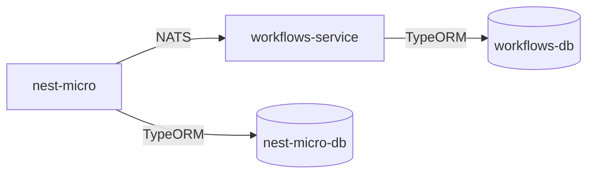

# NestJS Microservices Architecture

## Project Overview

This project demonstrates a microservices architecture using NestJS framework. It consists of multiple services that communicate with each other using NATS as a message broker. Each service has its own PostgreSQL database and can be run independently using Docker.

> **Note:** This project is currently under development and not all features are complete.

## Architecture

The project follows a microservices architecture with the following components:

- **nest-micro**: Main service that manages buildings and communicates with the workflows service
- **workflows-service**: Microservice that handles workflows associated with buildings
- **NATS**: Message broker for service-to-service communication
- **PostgreSQL**: Separate database instances for each service

### Communication Flow

## Project Structure

